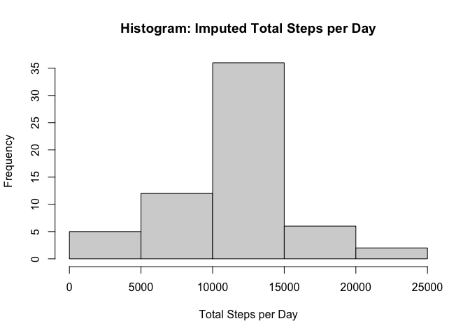

## Loading and preprocessing the data
First, load and process the data.


```r
unzip("activity.zip")
activdata <- read.csv("activity.csv")
```

## What is mean total number of steps taken per day?

We will first make a histogram illustrating the number of steps taken each day.


```r
totalperday <- aggregate(steps~date, activdata, sum)
hist(totalperday$steps, main = "Histogram: Total Steps per Day", xlab = "Total Steps per Day")
```

<!-- -->

Next, determine the mean number of steps per day:

```r
mean_steps <- mean(totalperday$steps)
mean_steps
```

```
## [1] 10766.19
```

Now, determine the median number of steps per day:

```r
median_steps <- median(totalperday$steps)
median_steps
```

```
## [1] 10765
```


## What is the average daily activity pattern?
We will start by making a time plot series of the 5-minute interval (x-axis) and the average number of steps taken, average across all days (y-axis)


```r
average_by_interval <- aggregate(steps~interval, activdata, mean)
plot(average_by_interval$interval, average_by_interval$steps, type="l", xlab="interval", ylab = "steps", main = "Time Plot Series: Average Steps")
```

<!-- -->

We can use our aggregated data to determine which interval has the max steps.


```r
max_interval <- average_by_interval$interval[which.max(average_by_interval$steps)]
max_interval
```

```
## [1] 835
```


## Imputing missing values

First, count the number of rows with NA in the dataset:

```r
sum(is.na(activdata$steps))
```

```
## [1] 2304
```

The strategy to fill in these missing values will be to replace the NA values with the mean for that interval. We had previously created that dataframe above:

```r
head(average_by_interval)
```

```
##   interval     steps
## 1        0 1.7169811
## 2        5 0.3396226
## 3       10 0.1320755
## 4       15 0.1509434
## 5       20 0.0754717
## 6       25 2.0943396
```

Now, use this to create create a new dataset that is equal to the original dataset but with the missing data filled in.

```r
imputeddata <- activdata
na_index <- which(is.na(activdata$steps), arr.ind = TRUE)
for (i in na_index) {
  currentinterval <- activdata[i, 3]
  imputedmean <- average_by_interval[average_by_interval$interval == currentinterval, 2]
  imputeddata[i, 1] <- imputedmean
}
```

Make a histogram of the total number of steps taken each day 


```r
totalperday2 <- aggregate(steps~date, imputeddata, sum)
hist(totalperday2$steps, main = "Histogram: Imputed Total Steps per Day", xlab = "Total Steps per Day")
```

<!-- -->

Calculate and report the **mean** and **median** total number of steps taken per day.

```r
mean_imputed_steps <- mean(totalperday2$steps)
mean_imputed_steps
```

```
## [1] 10766.19
```


```r
median_imputed_steps <- median(totalperday2$steps)
median_imputed_steps
```

```
## [1] 10766.19
```

These values are quite similar to the original. However, the median value of the imputed data now matches the mean. This is likely because the mean was used to substitute for the imputed data, so the data is now more centered around the mean values.

## Are there differences in activity patterns between weekdays and weekends?

Create a new factor variable in the dataset with two levels -- "weekday" and "weekend" indicating whether a given date is a weekday or weekend day.


```r
library(dplyr)
```

```
## 
## Attaching package: 'dplyr'
```

```
## The following objects are masked from 'package:stats':
## 
##     filter, lag
```

```
## The following objects are masked from 'package:base':
## 
##     intersect, setdiff, setequal, union
```

```r
factored_data <- mutate(imputeddata, wd = weekdays(as.Date(imputeddata$date)))
weekenddays <- c("Saturday", "Sunday")
factored_data <- mutate(factored_data, wd = ifelse(factored_data$wd %in% weekenddays, "weekend", "weekday"))
factored_data$wd <- factor(factored_data$wd)
```

We can represent this with a panel plot containing a time series plot of the 5-minute interval (x-axis) and the average number of steps taken, averaged across all weekday days or weekend days (y-axis).

```r
aggregated_data <- aggregate(steps~interval+wd, factored_data, mean)
library(ggplot2)
panel_plot <- ggplot(aggregated_data, aes(interval, steps, color=wd)) + facet_wrap(vars(wd), nrow=2) +geom_line()
print(panel_plot)
```

<!-- -->

